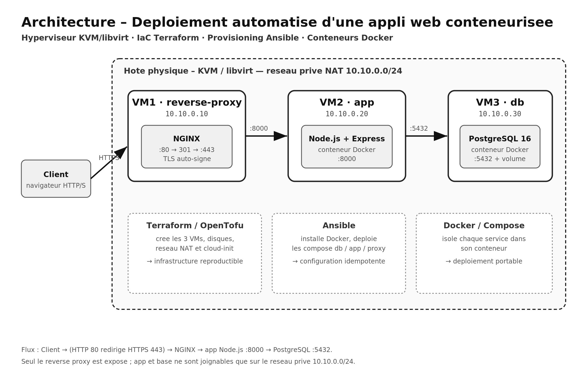

## 1. Introduction et contexte

Une PME exploite une application web interne — un outil de mémos d'équipe
(notes courtes partagées entre collègues) — historiquement installée à la main
sur un serveur unique. Cette organisation présente trois faiblesses concrètes :
les déploiements ne sont pas reproductibles (chaque réinstallation diffère
légèrement), la moindre opération de maintenance est risquée car il n'existe pas
d'environnement de référence, et les composants (serveur web, code applicatif,
données) cohabitent sur la même machine sans aucune isolation.

La direction informatique souhaite moderniser cet hébergement en s'appuyant sur
les quatre piliers étudiés en cours : la virtualisation, la
conteneurisation, l'Infrastructure as Code (IaC) et l'automatisation du
déploiement. L'objectif n'est pas de bâtir une infrastructure complexe, mais
une solution simple, cohérente et entièrement reproductible : on doit pouvoir
la détruire puis la recréer à l'identique sans aucune intervention manuelle.

L'application déployée est volontairement modeste (Node.js + Express côté serveur,
PostgreSQL pour les données) afin de concentrer l'effort sur l'infrastructure et
l'automatisation plutôt que sur le code métier. Elle reste néanmoins représentative
d'une vraie application web : pages dynamiques, formulaire et persistance en base.

## 2. Présentation de l'architecture

La solution répartit les responsabilités sur trois machines virtuelles, chacune
dédiée à un rôle unique, conformément au principe de séparation des préoccupations.
Cette organisation reproduit à petite échelle le découpage classique d'une
infrastructure web : une zone publique (le point d'entrée), une zone applicative
et une zone de données.



| VM              | Rôle                  | Logiciel (conteneur) | IP privée   | Ports exposés |
|-----------------|-----------------------|----------------------|-------------|---------------|
| `reverse-proxy` | Point d'entrée / TLS   | NGINX                | 10.10.0.10  | 80, 443       |
| `app`           | Application web        | Node.js + Express    | 10.10.0.20  | 8000 (privé)  |
| `db`            | Base de données       | PostgreSQL 16        | 10.10.0.30  | 5432 (privé)  |

Le client (navigateur) ne dialogue qu'avec le reverse proxy. Ni l'application
ni la base ne sont accessibles depuis l'extérieur : elles ne sont joignables que
sur le réseau privé `10.10.0.0/24`. Cela réduit fortement la surface d'attaque et
permet de faire évoluer ou de redémarrer un service interne sans impacter les
autres.

### 2.1 Réseau et accès

Le réseau est un réseau privé virtuel NAT en `10.10.0.0/24`, créé par
Terraform. La passerelle est `10.10.0.1` et chaque VM reçoit une adresse fixe
attribuée par cloud-init au premier démarrage. Le flux applicatif suit toujours le
même chemin :

```
Client ─HTTPS:443─▶ NGINX (10.10.0.10) ─HTTP:8000─▶ App (10.10.0.20) ─TCP:5432─▶ PostgreSQL (10.10.0.30)
```

Les règles d'accès sont les suivantes :

- le trafic HTTP (port 80) est systématiquement redirigé vers HTTPS (port
  443) par une réécriture `301` au niveau de NGINX,
- le reverse proxy assure la terminaison TLS (certificat auto-signé) puis relaie
  les requêtes vers l'application en transmettant les en-têtes `X-Forwarded-*`
  (conservation de l'IP client et du protocole d'origine),
- l'application et la base n'écoutent que sur le réseau privé (le port du
  conteneur est lié à l'IP interne de la VM), elles sont donc inatteignables depuis
  Internet.

Extrait de la configuration NGINX (redirection + proxy) :

```nginx
server {                       # 1. tout le HTTP est redirigé en HTTPS
    listen 80;
    return 301 https://$host$request_uri;
}
server {                       # 2. terminaison TLS puis relais vers l'app
    listen 443 ssl;
    ssl_certificate     /etc/nginx/certs/server.crt;
    ssl_certificate_key /etc/nginx/certs/server.key;
    location / {
        proxy_pass http://10.10.0.20:8000;
        proxy_set_header X-Forwarded-Proto $scheme;
    }
}
```

Rôle du reverse proxy. Il constitue l'unique point d'entrée de
l'infrastructure. Il centralise la terminaison TLS, masque la topologie interne et
permettrait, sans toucher à l'application, d'ajouter ultérieurement de la
répartition de charge, du cache statique ou un pare-feu applicatif.

## 3. Description de l'infrastructure virtualisée

L'hyperviseur retenu est KVM/libvirt, solution de virtualisation open source
intégrée au noyau Linux et standard sous Linux. Les trois VM sont des invités
Debian 12 (« Bookworm ») instanciés à partir d'une image cloud officielle,
ce qui évite toute installation manuelle de système d'exploitation.

L'intégralité de l'infrastructure est décrite en Terraform (provider open
source `dmacvicar/libvirt`), dans le dossier `terraform/`. Le code crée :

- un pool de stockage dédié sur l'hôte,
- une image de base Debian téléchargée une seule fois, dont le disque de
  chaque VM dérive via un mécanisme de *backing store* (économe en espace),
- le réseau privé NAT `10.10.0.0/24`,
- un disque cloud-init par VM, qui injecte au premier boot le nom d'hôte,
  l'utilisateur `cloud`, la clé SSH publique et l'adresse IP statique,
- les trois domaines (les VM elles-mêmes), générés à partir d'une simple
  structure de données.

Les trois VM sont déclarées dans une `map` unique, Terraform itère dessus avec
`for_each` pour produire automatiquement disque, disque cloud-init et domaine :

```hcl
variable "vms" {
  type = map(object({ ip = string }))
  default = {
    "reverse-proxy" = { ip = "10.10.0.10" }
    "app"           = { ip = "10.10.0.20" }
    "db"            = { ip = "10.10.0.30" }
  }
}
```

L'adressage statique et la préparation système sont délégués à cloud-init :

```yaml
# network-config : IP fixe attribuée à chaque VM
version: 2
ethernets:
  enp1s0:
    dhcp4: false
    addresses: [ 10.10.0.X/24 ]
    gateway4: 10.10.0.1
```

Ajouter, renommer ou réadresser une VM revient donc à modifier cette seule
description. L'environnement est ainsi idempotent et reproductible :
`terraform destroy` puis `terraform apply` reconstruit un état strictement
identique, sans dérive de configuration.

## 4. Présentation du déploiement automatisé

Une fois les VM créées et démarrées par Terraform, leur configuration et le
déploiement applicatif sont pris en charge par Ansible (dossier `ansible/`).
Ansible a été choisi pour son fonctionnement agentless (pilotage par SSH, sans
logiciel à installer au préalable sur les cibles) et pour son idempotence : on
peut rejouer le playbook autant de fois que nécessaire sans effet de bord.

Le playbook principal `site.yml` orchestre quatre étapes, ordonnées pour respecter
les dépendances entre services (la base avant l'application, l'application avant le
proxy) :

1. rôle `common` *(toutes les VM)* — installation de Docker Engine et du plugin
   Compose depuis le dépôt officiel Docker, puis activation du service,
2. rôle `database` — déploiement du conteneur PostgreSQL avec un volume
   persistant et un *healthcheck*,
3. rôle `app` — copie du code source, *build* de l'image applicative et
   démarrage du conteneur,
4. rôle `reverse_proxy` — génération du certificat TLS auto-signé, dépôt de la
   configuration NGINX et démarrage du conteneur.

```yaml
# site.yml : enchaînement des rôles par groupe d'hôtes
- hosts: all          ; roles: [ common ]        # Docker partout
- hosts: database     ; roles: [ database ]      # PostgreSQL
- hosts: app          ; roles: [ app ]           # application
- hosts: reverse_proxy; roles: [ reverse_proxy ] # NGINX + TLS
```

L'inventaire (`inventory.ini`) associe chaque groupe d'hôtes à l'IP fixe
correspondante. Le déploiement complet de la configuration tient donc en une seule
commande (`ansible-playbook site.yml`) et reste rejouable à volonté.

## 5. Description de la conteneurisation

Chaque service s'exécute dans son propre conteneur Docker, piloté par un
fichier `docker-compose` distinct sur chacune des VM. Cette isolation garantit que
les services ne partagent ni dépendances ni système de fichiers.

L'application est packagée par un `Dockerfile` multi-couches qui sépare
l'installation des dépendances de la copie du code (pour exploiter le cache de
build) et exécute le processus sous un utilisateur non privilégié :

```dockerfile
FROM node:20-slim
WORKDIR /app
COPY package.json ./
RUN npm install --omit=dev      # couche mise en cache tant que les deps ne changent pas
COPY server.js ./
EXPOSE 8000
USER node                       # exécution sans privilèges root
CMD ["node", "server.js"]
```

La connexion à la base est entièrement paramétrée par variables
d'environnement injectées par Compose (`DB_HOST`, `DB_USER`, `DB_PASSWORD`…). La
même image fonctionne donc dans n'importe quel environnement, sans modification.

```yaml
# compose de l'application : configuration injectée et port lié à l'IP privée
services:
  web:
    build: ./src
    environment:
      DB_HOST: "10.10.0.30"
      DB_USER: "techapp"
      APP_PORT: "8000"
    ports:
      - "10.10.0.20:8000:8000"   # joignable seulement par le reverse proxy
```
Côté données, PostgreSQL est lancé avec un volume persistant et un
*healthcheck* qui conditionne sa disponibilité :

```yaml
services:
  db:
    image: postgres:16
    volumes: [ "pgdata:/var/lib/postgresql/data" ]   # persistance des données
    healthcheck:
      test: ["CMD-SHELL", "pg_isready -U techapp -d techapp"]
volumes:
  pgdata:
```

Au démarrage, l'application attend activement que PostgreSQL réponde avant de
créer son schéma, et expose un *endpoint* `/health` qui vérifie la connexion à la
base — utile pour la supervision et les sondes de disponibilité.

## 6. Analyse et justification des choix techniques

Choix des technologies. KVM/libvirt, Terraform, Ansible, Docker et NGINX sont
tous open source, largement répandus et représentatifs des standards de
l'industrie, ce qui répond à la recommandation du sujet. Node.js + Express a été
préféré à une pile plus lourde car l'application reste légère et démarre
rapidement, PostgreSQL apporte une base relationnelle robuste et éprouvée.

Découpage de l'architecture. Répartir le proxy, l'application et la base sur
trois VM isole les responsabilités, limite la surface d'exposition (seul le proxy
est public) et permet de redémarrer, mettre à jour ou redimensionner un service
sans impacter les autres. C'est aussi un modèle directement transposable à une
infrastructure de production.

Avantages de la conteneurisation. Les images embarquent leurs propres
dépendances : le comportement est identique en développement et en production, le
déploiement est portable d'une machine à l'autre, et un service peut être recréé
en quelques secondes. Le découplage entre le code et son environnement d'exécution
simplifie également les mises à jour et les retours arrière.

Avantages de l'automatisation. Le couple Terraform + Ansible rend
l'infrastructure reproductible, versionnée et documentée par le code lui-même :
tout est décrit dans le dépôt, recréable à l'identique et tracé par Git. La reprise
après incident se résume à relancer le pipeline, et la dérive de configuration
disparaît grâce à l'idempotence.

Limites de la solution. L'infrastructure reste mono-hôte : l'hyperviseur
constitue un point de défaillance unique, sans haute disponibilité. Le certificat
TLS est auto-signé, ce qui provoque un avertissement navigateur (acceptable
pour un usage interne, à remplacer par une autorité de certification en
production). Le mot de passe de la base figure en clair dans les variables
Ansible et devrait être externalisé via *Ansible Vault*. Enfin, la solution
n'intègre pas encore de sauvegarde automatisée du volume PostgreSQL ni de
supervision centralisée : ce sont les axes d'évolution prioritaires, aux côtés
de la haute disponibilité et d'une chaîne d'intégration continue.

## 7. Conclusion

Le projet démontre une chaîne complète et cohérente, du provisionnement à
l'exécution : Terraform crée une infrastructure virtualisée reproductible sur
KVM/libvirt, Ansible la configure de façon idempotente, et Docker isole chaque
service derrière un reverse proxy assurant l'accès HTTPS. La solution est restée
volontairement simple, mais elle met concrètement en œuvre l'ensemble des principes
du Cloud Computing étudiés — virtualisation, Infrastructure as Code,
conteneurisation et automatisation — et peut être reconstruite intégralement en
deux commandes. Les évolutions naturelles identifiées (haute disponibilité,
sauvegardes, supervision et intégration continue) permettraient de faire passer
cette base saine vers un niveau de production.
